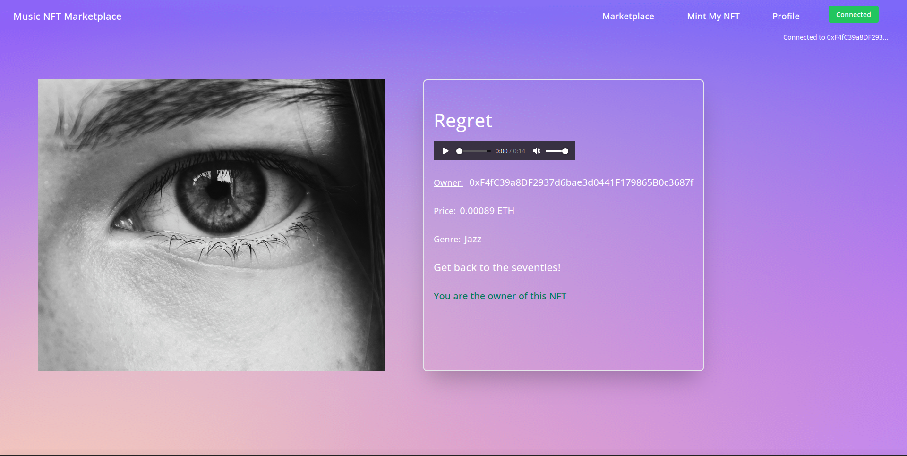

# Music NFT

## Overview

This is a proof of Concept for a Music NFT application built on top of the **Gerli Test Net**

## Tech Stack

**Solidity**
   : Used to write Eth Smart contracts following the **ERC 721** Strandard.
 
**Hardhat**  : used as a development environment for easier deployment of Smart contracts.

**Alchemy**   : Used to deploy our application to the Goerli Test net.

**Pinata**   : an IPFS to store metadata for our Non Fungible tokens.

**Goerli**  : Testnet that we're deploying our dApp on.

**Metamask**   : Wallet for our browser, enables us to make transactions through our dApp.

**Reactjs**   : Used to write the frontend of our dApp.

## Features

This distributed apps allows us to 

- List Music NFT's
- Mint new NFT's
- Buy NFT's from other creators

Each Music NFT contains a few features :
- Name
- Description
- Genre
- Album Cover URL (uploaded to IPFS)
- Music URL (uploaded to IPFS)

Here are a few screenshots showing the different capabilities :

### List NFT's

### User's Profile

### Minting an NFT

### NFT infromation

### Pinata IPFS

### Alchemy App

